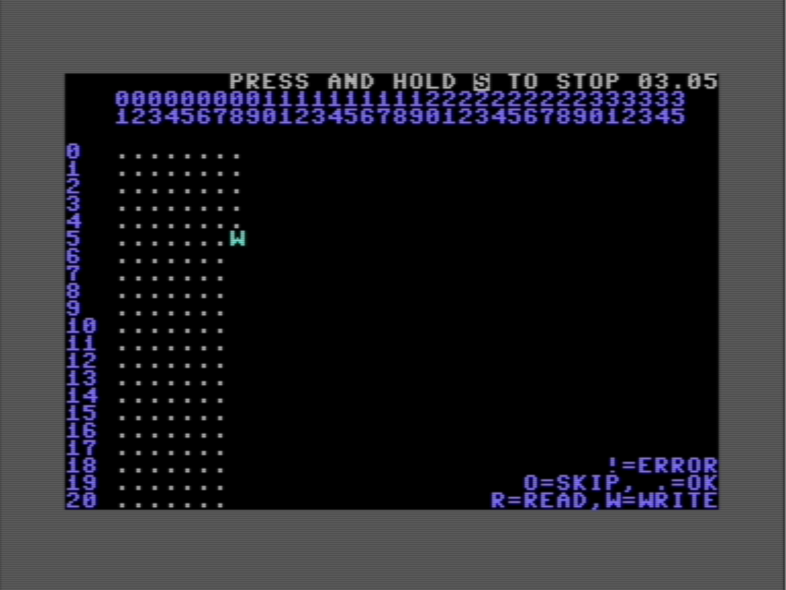

# 🌀 Another Disk Copy  
**Utility for the Commodore 64/128 to back up vintage floppy disks using two drives**

## 🎯 Motivation  
Preserving old software often requires duplicating aging floppy disks to fresh media. This utility was created for fun and inspired by the classic *DraCopy*. It helps enthusiasts and archivists back up their collections with ease.

## 💾 Supported Drives  
- Commodore VIC-1541  
- Commodore 1571 (in single-sided compatibility mode)

## 🔧 Usage Scenarios  
1. **Direct Backup**: Use two physical drives to copy old floppy disks to new ones.  
2. **Create Disk Images**: Generate a `.d64` image from a physical floppy using a second drive (e.g., Pi1541).  
3. **Restore Media**: Write a new floppy from a `.d64` image stored on Pi1541.

## Usage
Pre built disk image (.d64) and PRGs are already provied.

## Build
A working installation of oscar64 and VICE are required (be sure to have properly configure your PATH variable).
Just run build script in local folder

## 🚫 Disclaimer  
This utility is intended solely for archival and preservation purposes.  
**Do not use it to create unauthorized copies of software you do not own.**

